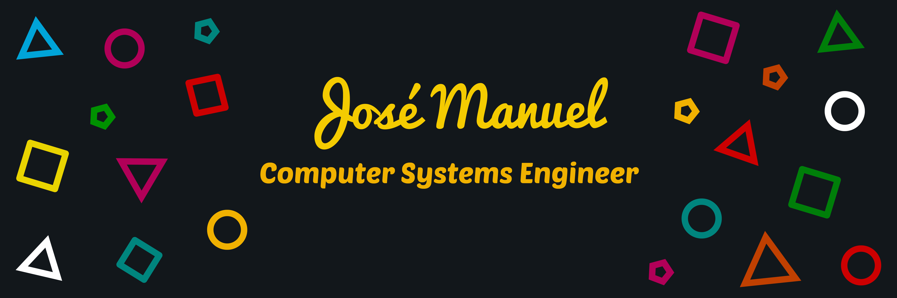

 

<h2 align="center">Quien soy? / Who am i?</h2>

  <samp>Soy Manuel, un programador junior enfocado en desarrollo web y especializado en redes informaticas, persona creativa con diferentes habilidades que me permiten autodenominarme FullStack Developer, actualmente sigo aprendiendo y mejorando mis conocimientos para ser un mejor programador el dia de mañana.
     
     
    I'm Manuel, a junior developer who focuses on web development and specialized in computer networks, a creative person with a group of skills that allows me to call myself Full-Stack Developer, at this time I'm learning and growing my knowledge so i can be a better programmer tomorrow day.
  </samp>

<h2 align="center">📈 GitHub Stats</h2>

  
    
  

<h2 align="center">💼 Skills</h2>

<h2  align="center">📫 Encuentrame en / Reach me on</h2>

  &nbsp;&nbsp;&nbsp;&nbsp;
  &nbsp;&nbsp;&nbsp;&nbsp;
  &nbsp;&nbsp;&nbsp;&nbsp;

