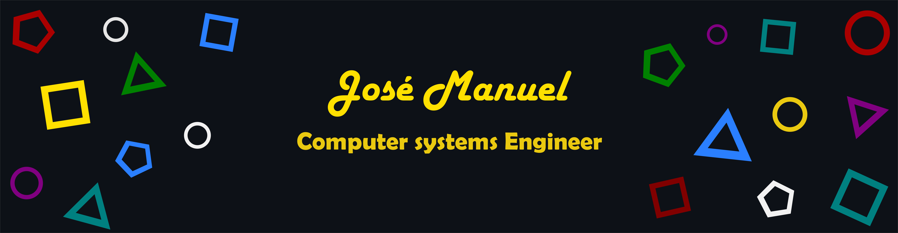

<h2 align="center">Quien soy? / Who am i?</h2>

  
Soy Manuel, un programador junior enfocado en desarrollo web y especializado en redes informaticas, persona creativa con diferentes habilidades que me permiten autodenominarme FullStack Developer, actualmente sigo aprendiendo y mejorando mis conocimientos para ser un mejor programador el dia de mañana.
     
     
    I'm Manuel, a junior developer who focuses on web development and specialized in computer networks, a creative person with a group of skills that allows me to call myself Full-Stack Developer, at this time I'm learning and growing my knowledge so i can be a better programmer tomorrow day.
  

<h2 align="center">💼 Habilidades / Skills</h2>

&nbsp;
&nbsp;
 
&nbsp;
&nbsp;
&nbsp;
&nbsp;
&nbsp;
&nbsp;
 
&nbsp;
 
&nbsp;
&nbsp;
&nbsp;
&nbsp;
&nbsp;
&nbsp;
&nbsp;
&nbsp;
&nbsp;
&nbsp;

